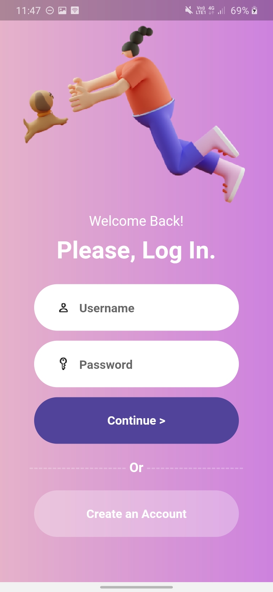
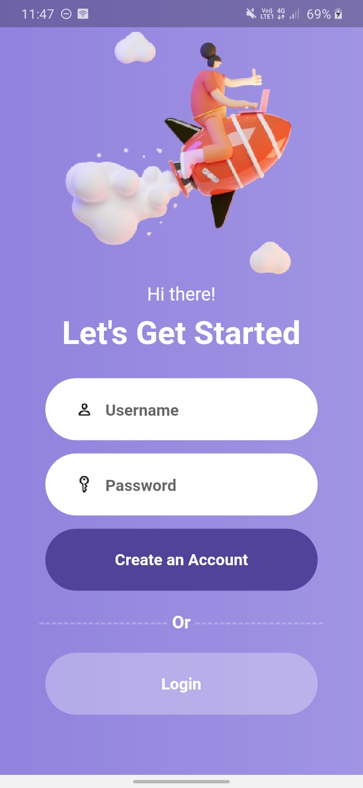
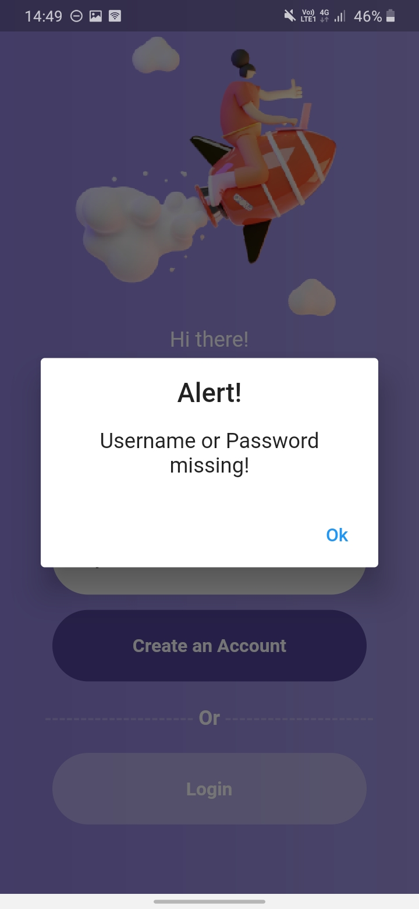
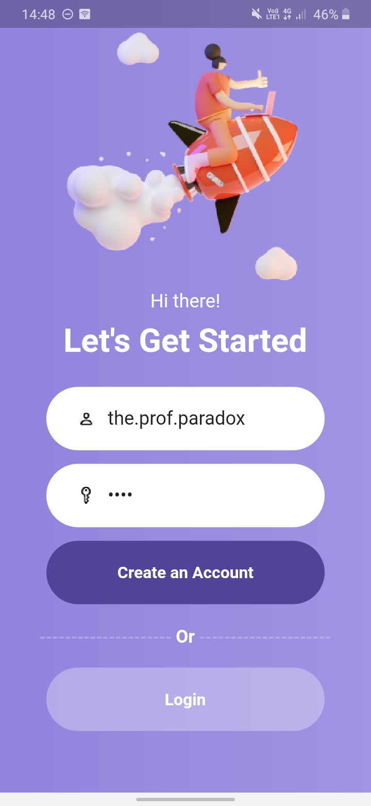
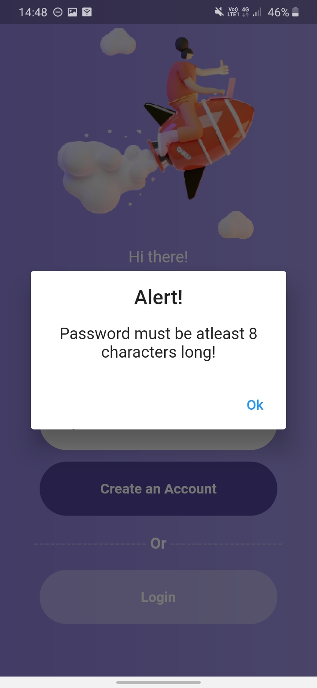

# Design 2 Flutter - Login and Signup Screen

## Hey there! 👋😁

This is my solution for
[Design 2 Flutter](https://www.reddit.com/r/Design2Flutter/)

## The challenge

The challenge was to create authentication screens (login and signup) and get it looking as close to the given design as possible.

## Levels Completed:

✔️ Beginner - Completed Static screen (no interactive component)

 

✔️ Advanced - Beginner + Have interactive components (validation - errors when missing username & password, switch between screens)

 

 
